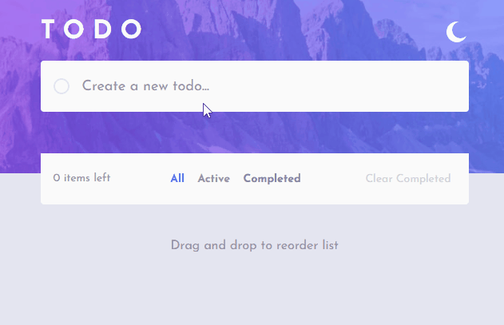
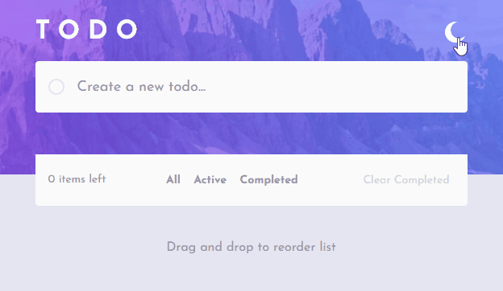
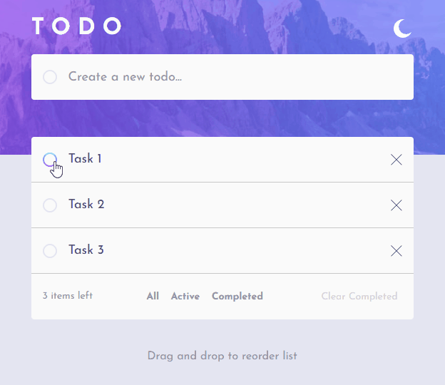
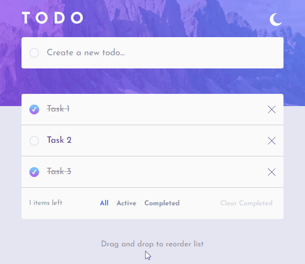
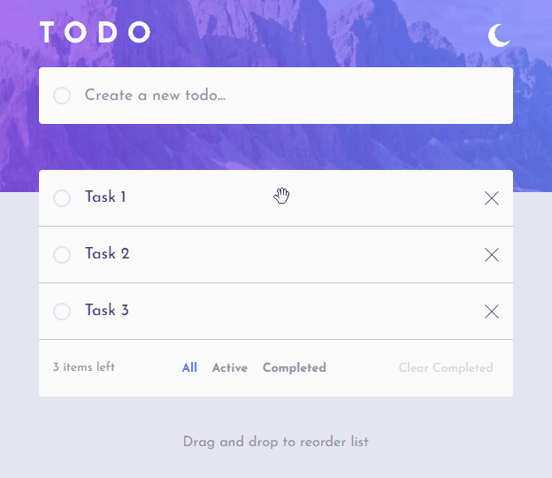
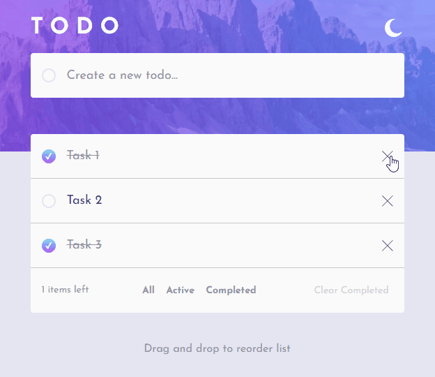

# TODO APP

## <b>📖 Project description</b>

This a single page application based on [Frontend Mentor Design](https://www.frontendmentor.io/challenges/todo-app-Su1_KokOW) where you can create and save tasks <i>to do</i>. You're also able to marks the tasks as conclude, exclude them and select using filters (all, active and completed).

## <b>✨ Project features</b>

- View the optimal layout for the app depending on their device's screen size;
- See hover states for all interactive elements on the page;
- Add new tasks to the list;
- Interaction with the navigator local storage to save the tasks;
- Mark tasks as complete;
- Delete tasks from the list;
- Filter by all/active/complete tasks;
- Clear all completed tasks;
- Toggle light and dark mode;
- Drag and drop to reorder items on the list.

## <b>🛠️ How to use</b>

Discover how easy it is to manage tasks with the Todo app. Below are the main features you can try:

<table>
  <tr>
    <td><b>🆕 Create New Tasks</b></td>
    <td><b>🎨 Change Theme</b></td>
  </tr>
  <tr>
    <td></td>
    <td></td>
  </tr>
  <tr>
    <td><b>✅ Mark Tasks as Completed</b></td>
    <td><b>🔍 Apply Filters</b></td>
  </tr>
  <tr>
    <td></td>
    <td></td>
  </tr>
  <tr>
    <td><b>🔄 Reorder Tasks</b></td>
    <td><b>🗑️ Delete Tasks</b></td>
  </tr>
  <tr>
    <td></td>
    <td></td>
  </tr>
</table>

## <b>📝 Extra details</b> 

- Aiming a better personalization to the drag and drop (DnD), I decided to develop a whole Dnd system from scratch by not using any native drag event from JS (dragstart, dragover, dragend, etc.);
- This system was developed int two strands: the <b>drag.js</b> and <b>overlap.js</b>.
- The <b>drag.js</b> is responsible for apply the movement of the the tasks elements next to the cursor by using
`item.style.left` and `item.style.top` property.
- The <b>overlap.js</b> identifies when a dragged element is overlapping other tasks and applies the interactions of switch/reorder positions;
- The coding process was really challenging, but algo very enjoyable because it allows me to learn a lot more of the DOM limitations/features/interactions and the Vanilla JS itself; 

## 💻 Technologies used

  
  
  

## 🌐 Access

You can access the project page on the this [link](https://todo-app-phi-two-51.vercel.app/) or access the [project files](https://github.com/Gabrield7/todo-app) in github.
